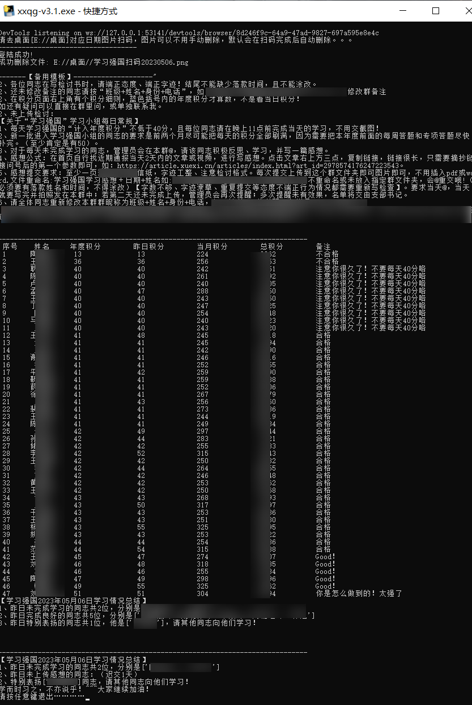
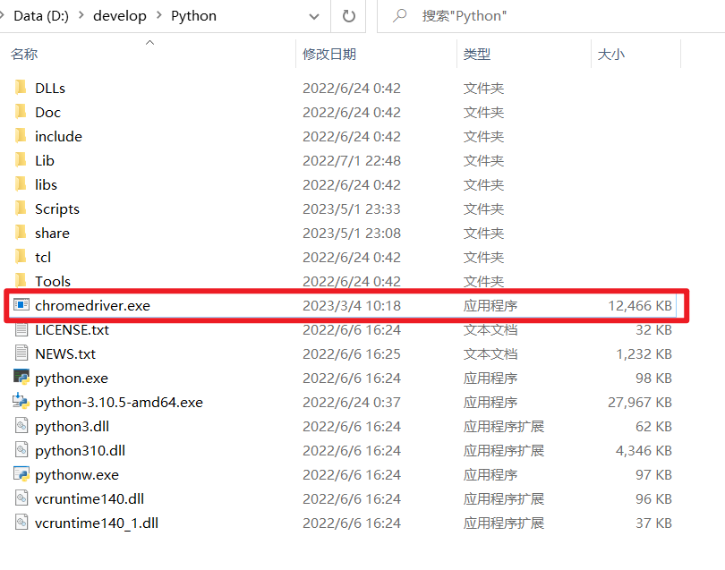

# 学习强国管理后台爬虫程序说明文档

> 【申明】该套程序只是用来便于学习强国各组织管理员对组织后台每位成员每日学习积分的统计、通报，不涉及机密、没有反动言论等。
>
> 作者：裴孝明
> 邮箱：mmmmmbl@163.com
> Github：[pxm95772 (明明明明明白了) ](https://github.com/pxm95772)

## 解决的问题

该脚本程序解决了每日学习强国管理员对自己组织下学员学习情况的统计，并生成统计报表（须要联网!!!），效果如图。



最新版本可以成立多个学习小组，每个小组可以设置自己独立的学习要求、规则等，整个运行总时长平均在15秒左右。

## 使用方式

这里以最新的xxqg-v3.1版本使用方式为例：

+ 准备工作

首先要在 `config.yaml` 设置 `myDesktop` 字段（获取方法可以参考xxqg-v3.1版本文件夹里图片说明），即可开始使用，（同时也可以通过 `updateConfig.py` 脚本生成config.yaml 配置文件，这样避免yaml编辑错误等各种问题，适合新手），详情可以参考v3版本说明文档。

[v3版本说明文档](./学习强国v3/v3版本说明文档.md)

+ 脚本运行

方式一：每次点击其中`xxqg-v3.1.exe`文件，程序会在桌面生成一张二维码，用学习强国扫一扫功能扫码后，确认身份后，程序继续即可获取学习报表数据，同时生成的图片也会自动删除。

方式二：在当前目录的控制台下输入以下命令，其后操做方式同上。

```
python xxqg-v3.1.py
```

## 获取浏览器驱动

因为该脚本程序使用python编程语言，使用selenium库来模拟浏览器操做，所以要用到python环境和Chrome浏览器驱动。下载地址如下。下载对应版本后（window都默认下载32位的），将其中的chromedriver.exe文件移动在python的安装目录里即可让程序操做浏览器了。

> http://chromedriver.storage.googleapis.com/index.html



