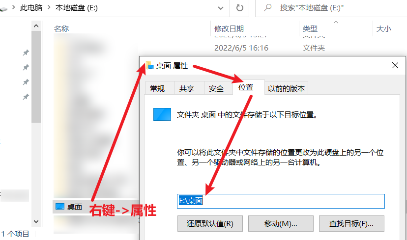

# 学习强国 V3 版本说明文档

> 【申明】该套程序只是用来便于学习强国各组织管理员对组织后台每位成员每日学习积分的统计、通报，不涉及机密、没有反动言论。
>
> 作者：裴孝明
> 邮箱：mmmmmbl@163.com
> Github：[pxm95772 (明明明明明白了) ](https://github.com/pxm95772)

该版本重点解决了v2版本大量依赖模拟点击的诟病，经常因为页面DOM变化而获取不到元素报错。

运行速度由之前版本的平均40秒提升到了平均15秒完成全套操做（包括了手动扫码的时间）。

后续大版本可能再试试用session记住、发出请求，并获取cookies，完成全套操做。哎太难了……

## xxqg-v3.0（2023‎年‎5‎月‎1‎日）

该版本解决了：

1. 更少量主动点击。
2. 用发送请求的方式避免了元素找不到、等待加载等等问题。
3. 使用selenium的驱动获取cookies。
4. 结合读写，获取元素截图，保存于桌面，便于扫码，并监测扫码是否完成，即刻删除截图。
5. 可变变量抽离，更便于代码维护，拓展性增强。所有可变的参数都可以在 `myOptions` 对象中获取。
6. 更多的函数。
7. emmm还有更多无聊的判断，一个人是“他”，多个人才是“他们”等等。


+ 全程不需要浏览器跳出（影藏浏览器）

```
opt = Options()
# 如果想要页面无法察觉到你是自动的程序，可以这样写，让浏览器的window.navigator=false
opt.add_argument("--headless")
opt.add_argument("--disable-gpu")
opt.add_experimental_option('excludeSwitches', ['enable-automation'])
opt.add_argument("--disable-blink-features=AutomationControlled")
```

+ 读写图片

```python
# 保存图片
img_save = WaitClick('//*[@id="root"]/div[1]/div')
imgfilesName = f"{myOptions['myDesktop']}//学习强国扫码{todaySTR}.png"
screenshotPNG = img_save.screenshot_as_png  # 截取后直接是二进制,无括号
with open(imgfilesName, mode="wb") as f:
    f.write(screenshotPNG)
```

+ 删除图片

```
# 删除图片的函数
def deletePNG(file_name):
    if os.path.exists(file_name):
        os.remove(file_name)
        print('成功删除文件:', file_name)
    else:
        print('未找到此文件:', file_name)
```

+ 从Web对象上获取cookies★

```
# 获取cookies
cookie_dict = {}
cookie_list = web.get_cookies()  # 获取cookies
for cookie in cookie_list:
    cookie_dict[cookie['name']] = cookie['value']
```

+ 发送请求，获取数据，更快、更稳、更高效★

```
# 请求URL、请求头、请求body参数
getDataReq = "https://odrp.xuexi.cn/report/commonReport"
headers = {
    "Cookie": f"csrf_token={cookie_dict['csrf_token']}; token_={cookie_dict['token_']}",
    "Referer": "https://study.xuexi.cn/",
    "Content-Type": "application/json",
}
data = {
    "apiCode": "ab4afc14",
    "dataMap": {
        "startDate": yesterdaySTR,
        "endDate": yesterdaySTR,
        "offset": 0,
        "sort": "rangeRealScore",
        "pageSize": 200,
        "order": "asc",
        "isActivate": "",
        "orgGrayId": "m91K4Ym3wtZLTJpglVIC5Q=="
    }
}
# 发出请求并判断失败与否
res = requests.post(getDataReq, headers=headers, data=json.dumps(data))
code = json.loads(res.text)['code']  # 获取请求的code，用于判断请求的成功
if code >= 300:
    print("token过期了，或其他错误。请排查后重试……")
    exit()
```


## xxqg-v3.1（2023‎年‎5‎月‎6‎日）

v3.1版本解决了：

1. 项目可配置的参数放入配置文件 `config.yaml` 中，随时可以修改，便于更大限度自定义地查询。
2. 利用 `updateConfig.py` 文件修改yaml配置文件，便于不熟悉yaml文件语法的同学修改配置文件，以免出面出现缩进、语法等不正确而导致读取配置失败或资源结构错误。
3. 注重代码结构，项目函数再次封装，更多细节的变化。
4. 引入捕捉报错模块，若有错，每次都可以看到报错说明。
5. 试图解决部分设备程序结束，控制台自动关闭问题，添加等待输入结束，可以通过关闭页面或Ctrl+C关闭程序。


+ 使用 `updateConfig.py` 文件

1、首先需要有python环境：[Python下载 | Python中文网 官网 (p2hp.com)](http://python.p2hp.com/downloads/)

2、安装yaml包

```
npm install yaml
```

3、修改配置文件，第一次至少设置 `myDesktop` 字段（大多数同学的地址应该是C:\User\Desktop）,方法如图：

若图片地址一直报错，可以尝试把地址里的每一个 `\` 更化成 `//`。如`C://User//Desktop`




其他参数可以根据注释信息自行修改……

组织ID `orgGrayId` 获取方式（目前测试，不填好像也是没有影响的……）


4、在当前工作目录下，运行该文件，生成/更新 `config.yaml` 配置文件

```
python updateConfig.py
```

> 若了解yaml文件当然可以直接对该文件直接修改，推荐修改前可以先备份一份。


各个字段的结构、说明：

```
updatedData = {
    # 请根据自身电脑桌面位置填写（推荐放桌面主要是方便快速找到生成的截图，其实放别的文件夹也是可以的）
    "myDesktop": "C://桌面",
    # 想要哪天的数据：0是今天，-1是昨天，-2是前天，以此类推；若填日期则是查看对应日期的数据（暂不支持）
    "DataDate": -1,
    # 组织ID，可以自行获取，在network中
    "orgGrayId": "",
    # 每当所有同志都完成了学习时会输出的话。
    "CopyAllPeopleOK": "",
    # 当有同志分数达到rank2时，会输出的话
    "CopyBestPeople": "",
    # 在可复制段落的最后一句话
    "CopyClosingRemarks": "",

    # 学习群组（每个组可以设置人员列表和规则列表）
    # 可以添加多个学习组，每组必须要有People和Rules对象，用于存人员名字数组和规则数组。
    # 规则数组里，每一条是一个对象，name是规则等级名，rank是指低于这个分数（不包括这个分数）则就是这个等级，Tips是该等级会返回的备注。
    # 【重要】若想要收集不合格、不错、非常好部分同志，规则名必须分别是Fail、Rank1、Rank2，否则暂时不收集
    "StudyGroup": {
        "JKDY": {
            "People": [
                "张三", "张四", "张五", 
            ],
            "Rules": [
                {"name": "Fail", "rank": 40, "Tips": "成绩低于40分"},
                {"name": "Warn", "rank": 41, "Tips": "成绩低于41分"},
                {"name": "Default", "rank": 45, "Tips": "成绩低于45分"},
                {"name": "Rank1", "rank": 50, "Tips": "成绩低于50分"},
                {"name": "Rank2", "rank": 100, "Tips": "成绩低于100分"},
            ]
        },
        "JKFZDX": {
            "People": [],
            "Rules": [],
        }
    },

    # 设置默认输出的模板，推荐顶格写，便于输出后复制。
    "printRuleTips": """
输出模板/输出模板/输出模板/输出模板/输出模板/输出模板/输出模板/输出模板/输出模板/输出模板
    """,
}
```
